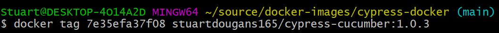

# cypress-docker
Dockerfile for Cypress CI


## local steps to update dockerfile

### 1. Open and edit the docker file as required
&ensp;&ensp;e.g. \
&ensp;&ensp;&ensp;&ensp;&& npm install -g "cypress@12.14.0" \\\
&ensp;&ensp;&ensp;&ensp;&& npm install -g 'cypress-cucumber-preprocessor@4.3.1' \

### 2. Run docker desktop locally

### 3. Build the docker image locally
&ensp;&ensp;```docker build .```

### 4. Tag (name) the image
&ensp;&ensp;```docker tag <image_id> \<username>/<container_name>:<tag\>```\



&ensp;&ensp;Tip: ```docker image ls``` to display local images

### 5. Push it to the remote docker hub
&ensp;&ensp;```docker push <container_name>:<tag\>```\
&ensp;&ensp;e.g. docker push cypress:0.0.1